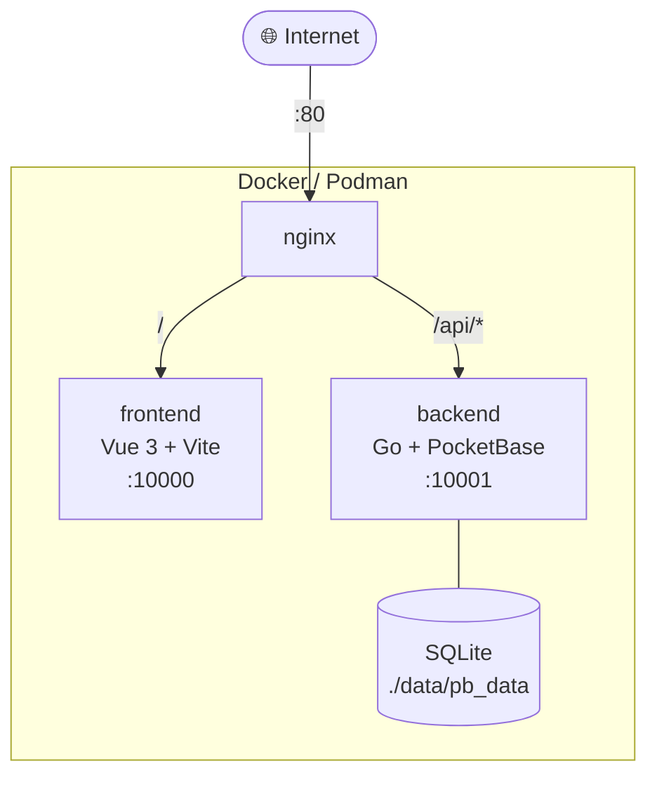

# CrowdSpeech

Crowdsourced multilingual voice dataset collection platform for English, Sinhala (සිංහල), and Tamil (தமிழ்).



## Stack

| Layer    | Technology                          |
|----------|-------------------------------------|
| Frontend | Vue 3 + Vite + TypeScript + Vuetify |
| Backend  | Go 1.23 + embedded PocketBase       |
| Database | SQLite via PocketBase               |
| Audio    | ffmpeg (16kHz mono WAV processing)  |
| Proxy    | nginx                               |
| CI/CD    | GitHub Actions → ghcr.io            |

## Quick Start (Docker)

```bash
# 1. Clone
git clone https://github.com/suhasdissa/crowdspeech.git
cd crowdspeech

# 2. Configure
cp .env.example .env
# Edit .env — generate a bcrypt hash for your admin password:
make genhash
# Paste the output as ADMIN_PASSWORD_HASH in .env

# 3. Deploy
make deploy
# Equivalent to: docker compose build && docker compose up -d

# 4. Open
open http://localhost
```

## Local Development

### Prerequisites
- Go 1.23+
- Node.js 20+
- ffmpeg installed in PATH
- (optional) podman or docker

### Backend
```bash
cd backend
go mod download
go run . serve --http=0.0.0.0:10001 --dir=./pb_data
# Admin UI: http://localhost:10001/_/
```

### Frontend
```bash
cd frontend
npm install
npm run dev
# Dev server: http://localhost:5173
# Proxies /api → http://localhost:10001
```

## Environment Variables

| Variable              | Description                                  | Default         |
|-----------------------|----------------------------------------------|-----------------|
| `ADMIN_PASSWORD_HASH` | bcrypt hash for export/admin protection      | **required**    |
| `PB_PORT`             | Port for the Go/PocketBase backend           | `10001`         |
| `PB_DATA_DIR`         | PocketBase data directory path               | `./pb_data`     |

Generate bcrypt hash:
```bash
make genhash
# or directly:
cd backend && go run ./cmd/genhash "yourpassword"
```

## API Endpoints

### Public
| Method | Path                                          | Description                      |
|--------|-----------------------------------------------|----------------------------------|
| GET    | `/api/collections/keywords/records`           | List keywords (PocketBase SDK)   |
| POST   | `/api/collections/recordings/records`         | Submit a recording               |
| GET    | `/api/stats`                                  | Contribution statistics          |

### Admin (requires `X-Admin-Password` header or `?password=` query)
| Method | Path                                          | Description                      |
|--------|-----------------------------------------------|----------------------------------|
| GET    | `/api/export?language=en`                     | Download ZIP of audio + CSV      |
| POST   | `/api/seed`                                   | Re-seed keywords (idempotent)    |

### Example export
```bash
curl -H "X-Admin-Password: yourpassword" \
  "http://localhost/api/export?language=si" \
  -o sinhala_export.zip
```

## Data Schema

### `keywords` collection
| Field           | Type   | Description                        |
|-----------------|--------|------------------------------------|
| `language`      | text   | `en`, `si`, or `ta`                |
| `text`          | text   | Keyword in native script           |
| `category`      | text   | Product category (e.g., "grains")  |
| `sample_target` | number | Target recordings per keyword      |
| `current_count` | number | Recordings collected so far        |

### `recordings` collection
| Field       | Type     | Description                           |
|-------------|----------|---------------------------------------|
| `language`  | text     | `en`, `si`, or `ta`                   |
| `keyword`   | relation | → keywords                            |
| `audio`     | file     | Original WebM/OGG upload              |
| `audio_wav` | file     | Processed 16kHz 16-bit mono WAV       |
| `duration`  | number   | Duration in seconds                   |
| `validated` | bool     | Manual quality validation flag        |

## Audio Processing Pipeline

```
Client records (WebM/OGG) → POST to PocketBase
    → ffmpeg hook (async):
        silenceremove (leading/trailing at -50dB)
        loudnorm (EBU R128, -16 LUFS)
        resample to 16kHz
        downmix to mono
        encode as 16-bit PCM WAV
    → audio_wav field updated
```

## Ports

| Service  | Internal Port | Exposed Port |
|----------|---------------|--------------|
| nginx    | 80            | 80           |
| frontend | 80            | 10000        |
| backend  | 10001         | 10001        |

> Note: Only nginx port 80 should be public. Ports 10000 and 10001 are internal.

## CI/CD

GitHub Actions workflow (`.github/workflows/build-and-push.yml`) builds and pushes images on every push to `main`:

- `ghcr.io/suhasdissa/crowdspeech-frontend:latest`
- `ghcr.io/suhasdissa/crowdspeech-frontend:{sha}`
- `ghcr.io/suhasdissa/crowdspeech-backend:latest`
- `ghcr.io/suhasdissa/crowdspeech-backend:{sha}`

## Deployment (Production)

```bash
# On your server
git clone https://github.com/suhasdissa/crowdspeech.git
cd crowdspeech
cp .env.example .env
# Edit .env with your admin password hash

# Pull pre-built images (faster than building on server)
docker compose pull
docker compose up -d

# Or build on server:
make deploy
```

To add SSL later:
```bash
# Install certbot, then modify nginx.conf with SSL directives
# Update docker-compose.yml to mount certbot volumes
```

## Contributing Keywords

The keyword list is seeded from a groceries JSON gist on first run. To add more keywords, either:
1. Edit the gist (if you own it)
2. POST directly to `/api/collections/keywords/records` via PocketBase admin UI
3. Add a migration file in `backend/migrations/`

## License

MIT
